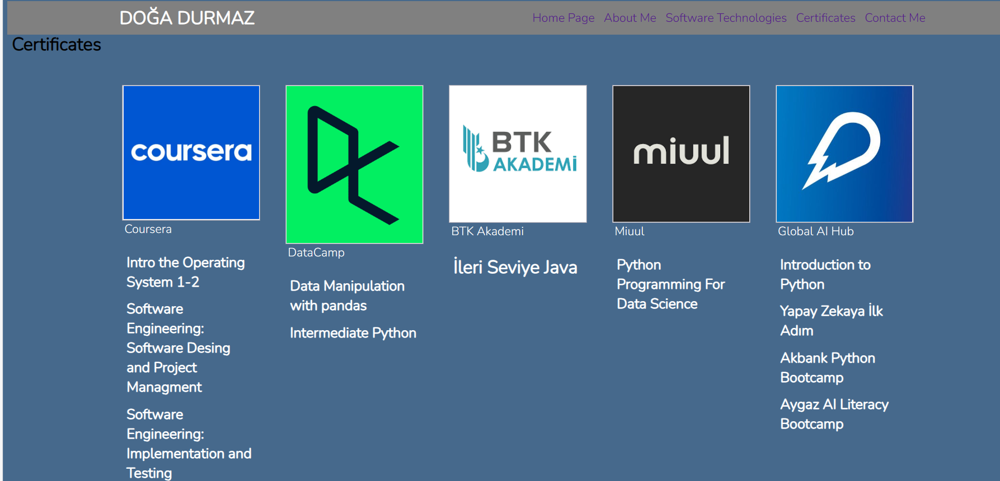
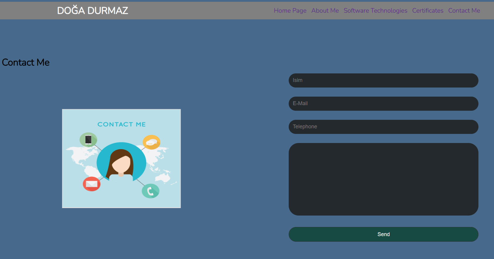

In this project my goal is create a  basic personal website using HTML and CSS which include basic knowledge about me. It has 5 section "Home Page", "About Me", "Software Technologies" , "Certificates" and, "Contact Me"

You can see the below some screen images

